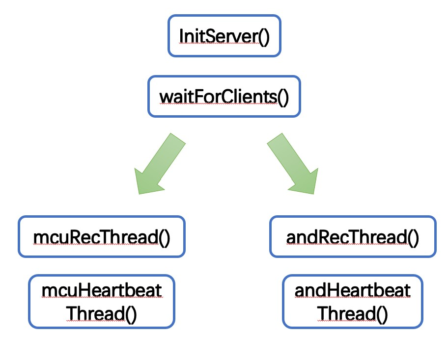

# Submodule of AutoPet Project -- Server


## Description
一个运行于公网linux服务器的服务程序，使用服务器中转客户端的信息实现类p2p通信。


## Usage

1. 在Linux终端：
```
$ git clone https://github.com/Rick0514/AutoPet-Server.git
```

2. 编译代码
```
$ sh obj.sh server.c server
```

3. 后台运行
```
$ sh run.sh ./server server.log
```


## Features

- [x] 只支持两个客户端，一个是MCU，一个是Android
- [x] 稳定运行只跟服务器有关，与客户端状况无关。


## Code Structure

<center></center>


* 初始化Socket

```
socket();
setsockopt();   //设置socket
bind();     // 绑定到端口
```

* 等待客户端
    * 这里只允许两个客户端，使用资源量为2的信号量，当指定客户端都与服务器建立TCP连接后，使改线程挂起。
    * accept出错记得释放信号量。
    * accept之后需要确认客户端身份，MCU端连接后需要发送“mcu”,而Android端需要发送“and”。

* 心跳线程
    * 服务器不断接收标记信号，并设置一个计数变量每秒加一。若收到一次标记信号变量置零。如果大于变量大于某个值，可以认为TCP连接断开。

* 接收线程
    * 接收心跳标记信号。
    * 接收安卓端控制信号后，发送到MCU客户。
    * 接收MCU发送的温湿度信息，发送到安卓客户。

